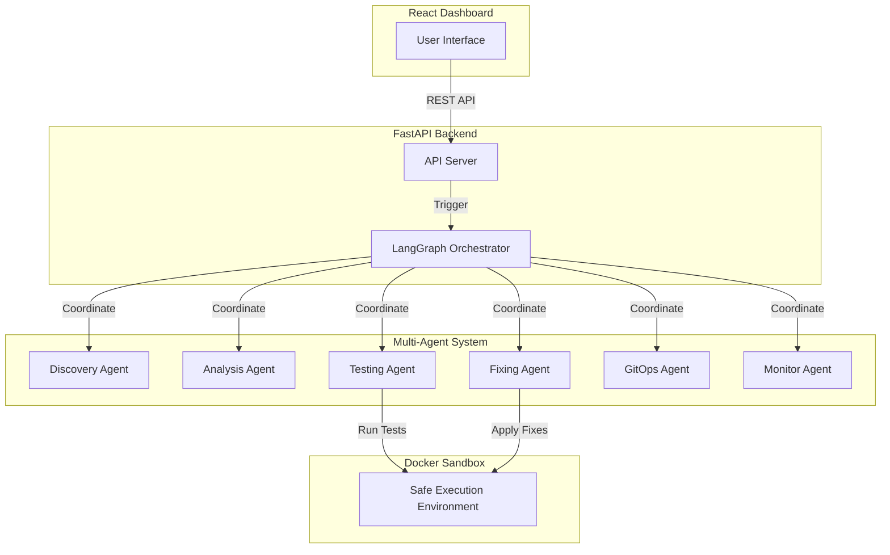
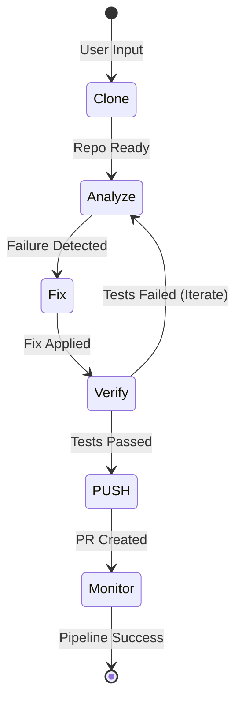
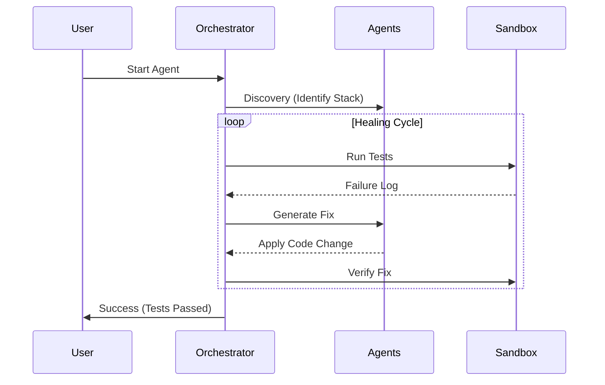

# 📊 Visual Assets for Presentation

You can render these diagrams using a Markdown previewer or [Mermaid Live Editor](https://mermaid.live/), then take screenshots for your slides.

## Slide 4: System Architecture

## Slide 5: Agent Workflow

## Slide 5: Detailed Iteration Flow

